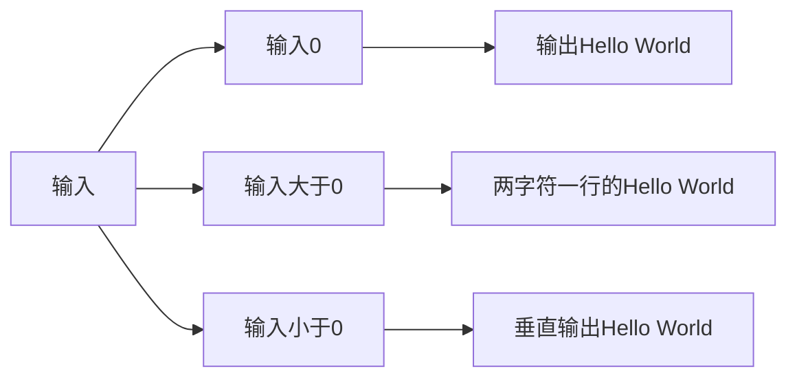
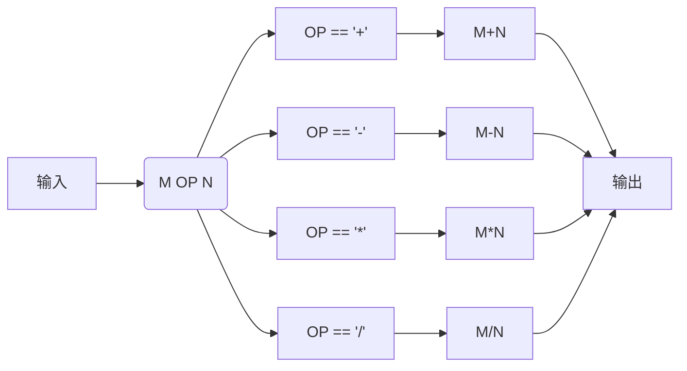

# Python语言程序设计第一周测验

[toc]

本课程是中国大学MOOC,北京理工大学——[Python语言程序设计](https://www.icourse163.org/course/BIT-268001)第一周测验，Github地址仓库欢迎[star](https://github.com/mrcangye/BIT_Python_2020Spring.git)

## Hello World的条件输出 

### 描述

获得用户输入的一个整数，参考该整数值，打印输出"Hello World"，要求：‪‬‪‬‪‬‪‬‪‬‮‬‪‬‮‬‪‬‪‬‪‬‪‬‪‬‮‬‭‬‪‬‪‬‪‬‪‬‪‬‪‬‮‬‫‬‮‬‪‬‪‬‪‬‪‬‪‬‮‬‭‬‫‬‪‬‪‬‪‬‪‬‪‬‮‬‫‬‫‬‪‬‪‬‪‬‪‬‪‬‮‬‭‬‫‬

如果输入值是0，直接输出"Hello World"‪‬‪‬‪‬‪‬‪‬‮‬‪‬‮‬‪‬‪‬‪‬‪‬‪‬‮‬‭‬‪‬‪‬‪‬‪‬‪‬‪‬‮‬‫‬‮‬‪‬‪‬‪‬‪‬‪‬‮‬‭‬‫‬‪‬‪‬‪‬‪‬‪‬‮‬‫‬‫‬‪‬‪‬‪‬‪‬‪‬‮‬‭‬‫‬

如果输入值大于0，以两个字符一行方式输出"Hello World"（空格也是字符）‪‬‪‬‪‬‪‬‪‬‮‬‪‬‮‬‪‬‪‬‪‬‪‬‪‬‮‬‭‬‪‬‪‬‪‬‪‬‪‬‪‬‮‬‫‬‮‬‪‬‪‬‪‬‪‬‪‬‮‬‭‬‫‬‪‬‪‬‪‬‪‬‪‬‮‬‫‬‫‬‪‬‪‬‪‬‪‬‪‬‮‬‭‬‫‬

如果输入值小于0，以垂直方式输出"Hello World"‪‬‪‬‪‬‪‬‪‬‮‬‪‬‮‬‪‬‪‬‪‬‪‬‪‬‮‬‭‬‪‬‪‬‪‬‪‬‪‬‪‬‮‬‫‬‮‬‪‬‪‬‪‬‪‬‪‬‮‬‭‬‫‬‪‬‪‬‪‬‪‬‪‬‮‬‫‬‫‬‪‬‪‬‪‬‪‬‪‬‮‬‭‬‫‬

 ‪‬‪‬‪‬‪‬‪‬‮‬‪‬‮‬‪‬‪‬‪‬‪‬‪‬‮‬‭‬‪‬‪‬‪‬‪‬‪‬‪‬‮‬‫‬‮‬‪‬‪‬‪‬‪‬‪‬‮‬‭‬‫‬‪‬‪‬‪‬‪‬‪‬‮‬‫‬‫‬‪‬‪‬‪‬‪‬‪‬‮‬‭‬‫‬

 ‪‬‪‬‪‬‪‬‪‬‮‬‪‬‮‬‪‬‪‬‪‬‪‬‪‬‮‬‭‬‪‬‪‬‪‬‪‬‪‬‪‬‮‬‫‬‮‬‪‬‪‬‪‬‪‬‪‬‮‬‭‬‫‬‪‬‪‬‪‬‪‬‪‬‮‬‫‬‫‬‪‬‪‬‪‬‪‬‪‬‮‬‭‬‫‬

### 输入输出示例

|        | 输入 | 输出          |
| ------ | ---- | ------------- |
| 示例 1 | `0`  | `Hello World` |

以下是这个程序的流程：



由这个流程图我们容易了解到使用条件语句进行判断输入值的大小

### 答案

我们开始编写：

```python
n = eval(input())	#输入得到的是字符串，我们要使用eval将其转化为数值类型
if n == 0:
    print("Hello World")
elif n > 0:
    print("He\nll\no \nWo\nrl\nd")	#\n是换行符
else:
    for c in "Hello World":
        print(c)
```


## 数值运算

### 描述

获得用户输入的一个字符串，格式如下：‪‬‪‬‪‬‪‬‪‬‮‬‪‬‮‬‪‬‪‬‪‬‪‬‪‬‮‬‭‬‪‬‪‬‪‬‪‬‪‬‪‬‮‬‫‬‮‬‪‬‪‬‪‬‪‬‪‬‮‬‭‬‫‬‪‬‪‬‪‬‪‬‪‬‮‬‫‬‫‬‪‬‪‬‪‬‪‬‪‬‮‬‭‬‫‬

M OP N‪‬‪‬‪‬‪‬‪‬‮‬‪‬‮‬‪‬‪‬‪‬‪‬‪‬‮‬‭‬‪‬‪‬‪‬‪‬‪‬‪‬‮‬‫‬‮‬‪‬‪‬‪‬‪‬‪‬‮‬‭‬‫‬‪‬‪‬‪‬‪‬‪‬‮‬‫‬‫‬‪‬‪‬‪‬‪‬‪‬‮‬‭‬‫‬

其中，M和N是任何数字，OP代表一种操作，表示为如下四种：+, -, *, /（加减乘除）‪‬‪‬‪‬‪‬‪‬‮‬‪‬‮‬‪‬‪‬‪‬‪‬‪‬‮‬‭‬‪‬‪‬‪‬‪‬‪‬‪‬‮‬‫‬‮‬‪‬‪‬‪‬‪‬‪‬‮‬‭‬‫‬‪‬‪‬‪‬‪‬‪‬‮‬‫‬‫‬‪‬‪‬‪‬‪‬‪‬‮‬‭‬‫‬

根据OP，输出M OP N的运算结果，统一保存小数点后2位。‪‬‪‬‪‬‪‬‪‬‮‬‪‬‮‬‪‬‪‬‪‬‪‬‪‬‮‬‭‬‪‬‪‬‪‬‪‬‪‬‪‬‮‬‫‬‮‬‪‬‪‬‪‬‪‬‪‬‮‬‭‬‫‬‪‬‪‬‪‬‪‬‪‬‮‬‫‬‫‬‪‬‪‬‪‬‪‬‪‬‮‬‭‬‫‬

注意：M和OP、OP和N之间可以存在多个空格，不考虑输入错误情况。‪‬‪‬‪‬‪‬‪‬‮‬‪‬‮‬‪‬‪‬‪‬‪‬‪‬‮‬‭‬‪‬‪‬‪‬‪‬‪‬‪‬‮‬‫‬‮‬‪‬‪‬‪‬‪‬‪‬‮‬‭‬‫‬‪‬‪‬‪‬‪‬‪‬‮‬‫‬‫‬‪‬‪‬‪‬‪‬‪‬‮‬‭‬‫‬

### 输入输出示例

|        | 输入               | 输出          |
| ------ | ------------------ | ------------- |
| 示例 1 | `10 + 100 1 / 20 ` | `110.00 0.05` |

 流程如下，且数值保留小数点后2位。



看起来这个流程很烦。

但是我们这周学习到的`eval()`函数告诉我们，`eval()`可以去掉字符串的引号

所以：

答案：

```python
print("%.2f"%eval(input()))
'''
解析：
eval(input())将输入的字符串去掉引号
在python中，表达式格式的字符串去掉引号，意味着：

Python 3.7.5 (default, Nov 20 2019, 09:21:52) 
[GCC 9.2.1 20191008] on linux
Type "help", "copyright", "credits" or "license" for more information.
>>> 3+5
8

上面这种显示
所以eval()处理过的字符串我们直接输出就可以了
再保留两位小数，即可得到答案

'''
```

