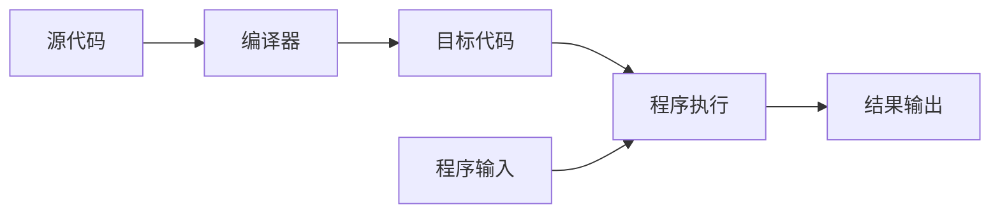
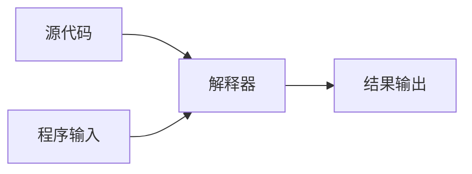

# 北京理工大学——Python语言程序设计(一)Python基本语法元素

[toc]

本课程是中国大学MOOC,北京理工大学——[Python语言程序设计](https://www.icourse163.org/course/BIT-268001)第一周笔记，Github地址仓库欢迎[star](https://github.com/mrcangye/BIT_Python_2020Spring.git)

## 前言

疫情期间的计划是学习北大的C++和北理工的Python，课程的题解我会尽量的做出解释。我一直认为实践——尽量认识——再实践，循环往复是掌握一门技能最好的办法，也希望读者尽量动手实践。要不然脑海里也只是一些印象，远远谈不上了解，更不提掌握了，当然，既然一起学习这门课，我们就理所当然都是同学啦，同学之间一起学习，对知识的认知产生错误也是不可避免的，如果有误，请及时能在评论区提出，感谢。

## 编译和解释

计算机执行源程序有两种方式：

编译和解释

### 什么是编译？

将源代码一次性转换成目标代码的过程,一次性翻译，之后不需要源代码，类似于英文翻译。使用这种方式执行的语言称为静态语言，例如：C/C++，Java

优点在于程序运行速度快，编译器一次性生成代码。



### 什么是解释？

将源代码逐条转换成目标代码同时逐条运行的过程。每次运行时边翻译边执行，类似于同声传译。使用这种方式执行的语言称为脚本语言，例如Python，JavaScript，PHP

优点是维护灵活。




## 第一样例

```python
#CalCircle.py
求出圆的面积
r = 25
area = 3.1415 * r * r
print(area)
print("{:.2f}".format(area))
```


## 第二样例

```python
#TempConvert.py
#同切圆
import turtle		
'''
在ubuntu　python3　中如果怎么pip3都安装不了tkinter
请试试 :
sudo apt-get install python3-tk
'''

turtle.pensize(2)
turtle.circle(10)
turtle.circle(40)
turtle.circle(80)
turtle.circle(160)
```


## 第三样例

```python
#StarDraw.py
#绘制星星
from turtle import *
color('red','red')
begin_fill()
for i in range(5):
    fd(200)
    rt(144)
end_fill()
done()
```


## 温度转换程序

```python
#TempConvert.py 单行注释
'''
多行
注释
'''
TempStr = input("请输入带有符号的温度值:")
'''
变量:TempStr,输入数据并赋值给TempStr
''' 
if TempStr[-1] in ['F','f']:
    C = (eval(TempStr[0:-1])-32)/1.8
    print("转换后的温度是{:.2f}C".format(C))
elif TempStr[-1] in ['C','c']:
    F = 1.8 * eval(TempStr[0:-1])+32
    print("转换后的温度是{:.2f}F".format(F))
else:
    print("输入格式错误")
```


### 字符串序号

在`Python`中，字符串的标记有正向和反向两种。

正向递增序号从`0`开始，反向递减序号从`-1`开始

### 字符串的使用

索引：返回字符串中的单个字符		<字符串>[M]

例如：`TempStr[-1]`,返回字符串中最后一个字符

切片：返回字符串中一段字符子串		<字符串>[M:N]

例如：`TempStr[0:-1]`，返回第一个字符到最后一个字符前为止

### 判断元素是否在列表中：

```python
TempStr[-1] in ['C','c']
```

### 评估函数eval()

去掉参数最外侧引号并执行余下语句的函数

例如：

```python
>>> eval("1234")
1234
```

